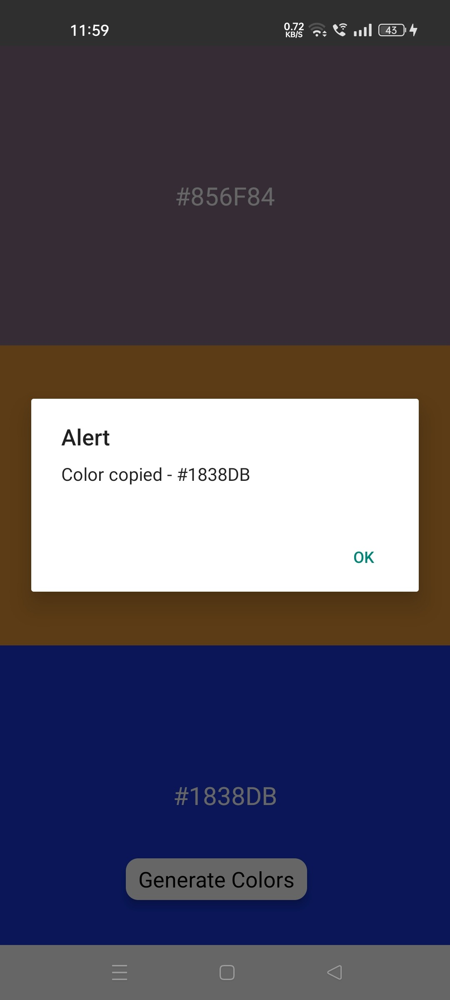

# React Native Random Color Palette Generator
In this tutorial, we will build a React Native Random Color Palette Generator. The project will allow users to generate a random color palette and copy the palette to use anywhere.

### Features
- Generate a random Palette of 3 colors
- Copy the color codes

You can watch the complete tutorial on how to build this color palette generator [here](https://youtu.be/k1VMP0Xv6Ro)

### What will we building?

|  |  |
| :-------------: | :-------------: |
